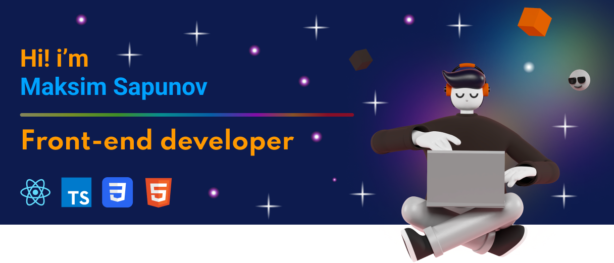

    <h3>Connect with me:</h3>  
    

### About Me

🏠 I'm **Front-end Developer** living in **Ryazan**.  
⭐ I'm currently learning **TypeScript** and **React**  
❤️ And I enjoy making beautiful web sites on **HTML**,**CSS** and **JavaScript**

<h3>💼 Technical skills:</h3>

 

 

 

 

<h3>🏆 Achivements:</h3>
  

